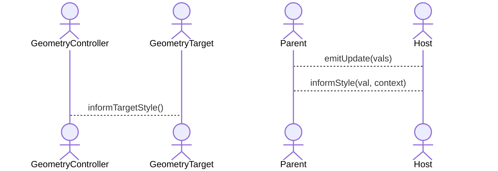

# Geometry

```mermaid
sequenceDiagram
actor GeometryController
actor GeometryTarget
actor Parent
actor Host

Host --> Parent : emitUpdate(vals)
Parent --> Host : informStyle(val, context)
GeometryController --> GeometryTarget: informTargetStyle()

```
