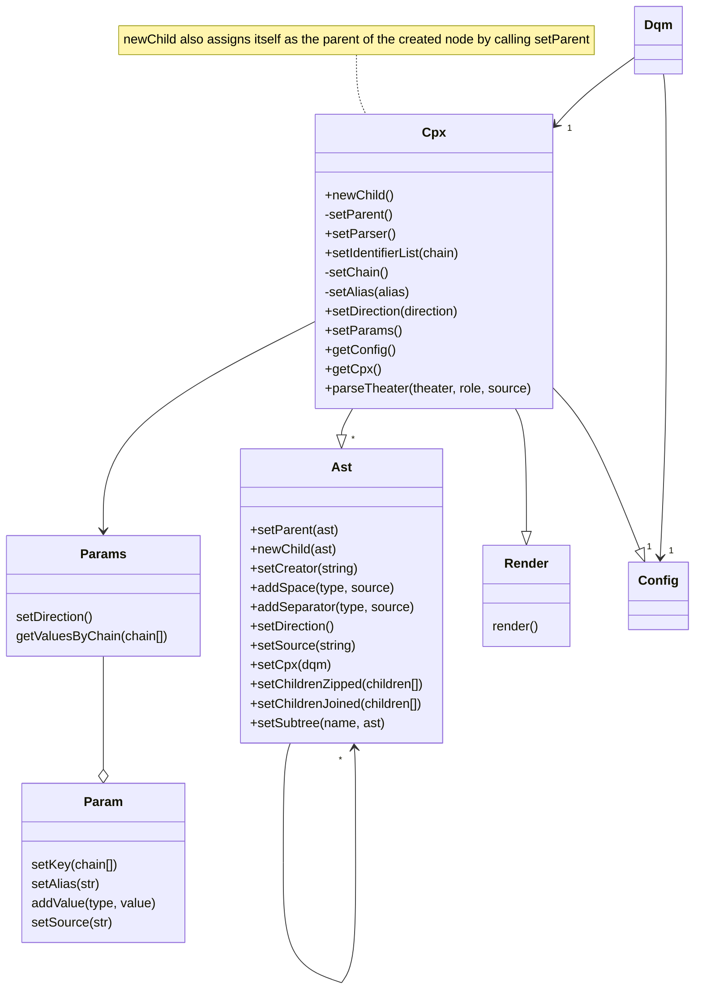
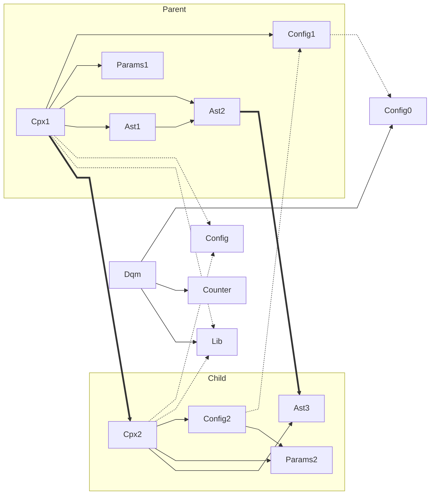
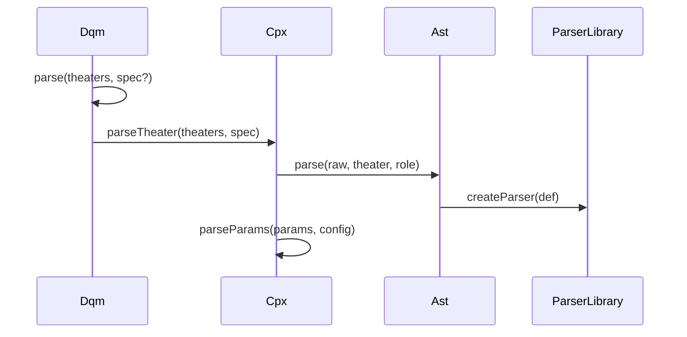
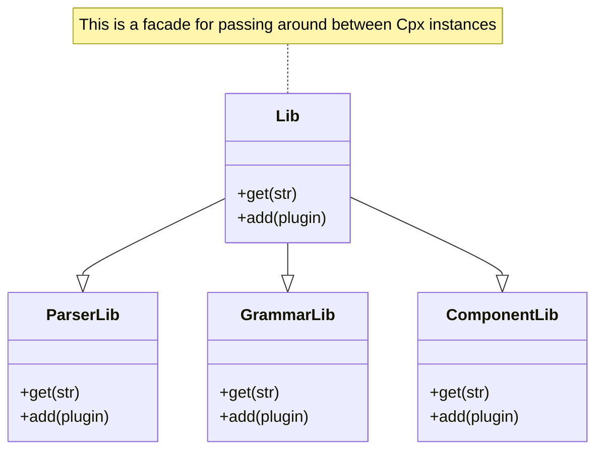

# Dqm

- Ohmjs actions return an Ast node.
- All Ast nodes belong to some Cpx node
- Cpx nodes create conceptual groups of ast nodes. Many ast nodes that belong to a FrameV2 structure correspond to a single Cpx node
- Cpx nodes need a definition so that they know what component and parser to use for their nodes of influence
- Cpx subtree is for Ast nodes that need to exist because the parser may need to create expressions for the ease of development of the grammar or because the nature of the parser don't allow removing a certain node that isn't relevant to the end user but is relevant to the language parsing.
- Inline components cannot allow block pauses but block components can allow both inline and block pauses.
- Dqm provides user customizations at the parseTheater method, if the user is expected to set config through tags, or any other method, this is where that integrates to.
- Dqm root class holds the config for the defaults and the application
- Ohmjs actions create "ohm" nodes while rich text decorations create "synthetic" ast nodes
- Conceptually, frameV2Config node is the container of the frame as its params need to be parsed before the component for the component to be instantiated.



## Ast node instance shapes



This is a bit of a complicated graph but it's important

- Cpx is the class instance that holds this structure together.
- Cpx have their own config instances. but they create their instance by cloning their parent's their config. this is why Dqm's config is referenced by Cpx1's config, which in turn is referenced by Cpx2's config.
- Lib is a facade that offers access to plugins for the language, This includes components, grammars and parsers but not renderers. Rendering is a separate concern that isn't in Dqm plugin structure.
- Params class contains Param instances, Params's value comes from being able to index and search through param instances. These classes are needed because the param object has became quite involved to meet the demands of future proofing.
- Thicker lines signify references that pass Cpx boundaries
- dotted lines reference objects that don't belong to a particular instance.
- Configs in Cpx use Params as params are the final contributor the config of a Cpx after:
  - Language defaults
  - Component defaults
  - Application provided config
  - Parent Config
  - `Params`

# Component instantiation

```ts
const cpx = new Cpx()
  .setParser("BaseV2")
  .setIdentifierList(["base", "v2", "default"])
  .setParams(
    this.config, // instanceof check
    getTagParams()
  )
  .setDirection("block")
  .setHooks(
    // or this.hooks which should hold the same objects
    {
      grammarLib: GrammarLib
      componentLib: ComponentLib
      parserLib: ParserLib
    }
  );
```

# Ast instantiation for a non-boundary node

This happens inside ohmjs actions

```ts
const { parentCpx, parentAst } = getContext(this); // returns the active cpx instance
const childAst = parentAst.newChild().setCpx(parentCpx);
// const context = childAst.getContext();
childAst
  // html display context, inline or block for nodes that won't be reflected in the render, this value shall remain undefined
  .setDirection("block")
  // or synthetic for decorator nodes
  .setNature("ohm")
  // this is what transform nodes use for determining which render node to send the data to
  .setCreator(this.ctorName)
  // component membership
  .setCpx(parentCpx)
  // registers indentations, spaces between tokens and payloads
  .addSpace("prefix", sp.sourceString)
  // separators such as "," , tokens such as "[" "|" "]" for frames
  .addToken(
    "leftElement",
    "rightElement",
    "separator",
    // TODO should it pass the method reference instead of the call?
    // the addToken method could call reference with the context itself
    // which means the context would never be exposed like this.
    // This may mean that I may need to bind `this`
    sepNode
  )
  // the source slice from the input
  .setSource(this.sourceString)
  // these ast nodes belong to the component, such as frameConfig in frameV2
  .addSubtreeNode("frameConfig", "method", frameConfig)
  // this expects a list of children with the first child that is definitely defined
  .setChildrenNonEmptyListOf(
    "method",
    [child1],
    [child2[], child3[], ...]
  )
  // this expects a list of children that may be empty
  .setChildrenListOf("method", [child1[], child2[]]);
```

### A Note about `children` methods

Ohmjs groups similar node types in arrays, so the parsing needs to zip these. for this, the methods above expect an array of children.

In the case of a guaranteed initial elements, the first element of the array is an array of definitely defined nodes. This is what you see in `setChildrenNonEmptyListOf`.

# Ast Instantiation for a boundary node

```ts
const { parentCpx, parentAst } = getContext(this);
const cpx = parentCpx
  // TODO new child may need to instantiate a series of children as
  // frames can define multiple nested components at once:
  // Example: [pre code|...]
  // so the child that is returned by this would be the leaf, I suppose
  // in the example above, getParent() would return `pre`
  .newChild(chains)
  // TODO Cpx will probably get its direction from the parent of the Ast node.
  .setDirection("block");
//   .setIdentifierList(["frame", "v2", "default"]);

const ast = parentAst
  .newChild()
  // TODO there may need to be an error if cpx is assigned before direction is assigned
  .setDirection("block")
  .setCpx(cpx);
```



### Rich text decorations

rich text wrappers use `RankiRenderPluginItem` registrations to alter what renderer handles the text decoration rendering

```dqm
[frame,
decoration += * html.primitive.emphasis.container.inline

*dfdf*
]
```

Of course aliases would work too

this is the approximate ast node shape

```ts
{
  creator: "*",
  // ...
  children: [
    {
      creator: "_"
    }
  ]
}
```

this is what the transformer does:

```ts
if(creator.length > 1) {
  // regular creator handling
}
const rendererTag = ComponentConfig.decorators[creator]
if(!rendererTag) {
  throw new Error(`DECORATOR FOR ${decorator} DOES NOT EXIST`)
}
return {
  tag: rendererTag
  children: [
    {
      // ...
    }
  ]
}
```

The configuration should overwrite the value for "\*" if a new one is defined. And depending on the strictness settings, maybe it can throw a warning or an error on in the case of an overload.

# Libraries



It could make sense for the libraries to have a common interface. `Lib` can call them in similar ways through that.

Grammars and parsers could have each other as dependencies so a format such as:

```ts
Lib.get("parser:FrameV2");
Lib.get("grammar:ParamsV2");
```

Could make sense.

## Handling decorations in ast

decorations are scoped to lines, so at line object `lexeme` source string.

## Counter

```ts
Counter.increment(ast);
Counter.increment(cpx);

class Counter {
  private counts = {};

  getIndex(node) {
    // produces some kind of index for the given node,
    // this can be used in framev2 for:
    // [placeholder, for = A.0]
    // for the first frame in A theater for example
    // which could be a handy way to resolve using indices to build
    // placeholders.
  }

  increment(node: SomeKindOfUnion) {
    switch(instanceof node) {
      case "ast":
        const creator = ast.creator;
        const chainStr = ast.getCpx().getChainString();
        const index = ast.getCpx().getIndex();
        [
            creator,
            [chainStr, creator].join(":"),
            [chainStr,index, creator].join(":"),
            // there could be others here
        ]
          .map((v) =`ast:${v}`)
          .forEach((key) => {counts[key]++ })
        break;
      case "cpx":
        const chainStr = cpx.getChainString();
        [
          chainStr
        ]
          .map((v) =`cpx:${v}`)
          .forEach((key) => {counts[key]++ })
        break;
    }
  }
}
```
